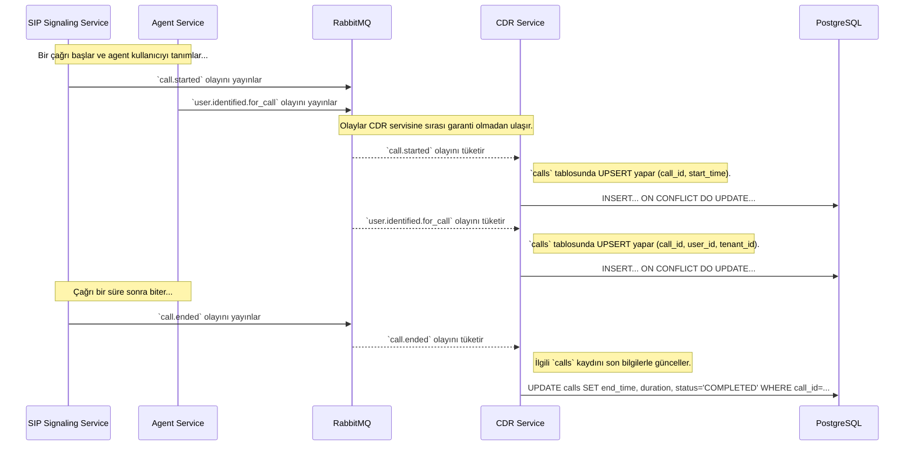

# 📊 Sentiric CDR Service - Mantık ve Akış Mimarisi

**Belge Amacı:** Bu doküman, `cdr-service`'in platformun **"kara kutusu" ve yasal hafızası** olarak rolünü, nasıl çalıştığını ve diğer servislerle etkileşimini açıklar.

---

## 1. Stratejik Rol: "Tarafsız Gözlemci"

Bu servisin tek görevi, platformda olan biten **her şeyi sessizce dinlemek ve kalıcı olarak kaydetmektir.** Hiçbir iş akışını başlatmaz veya etkilemez.

**Bu servis sayesinde:**
1.  **Raporlama Mümkün Olur:** Faturalandırma, analiz ve yönetici panelleri için gerekli olan tüm çağrı detay kayıtları (Call Detail Records - CDR) oluşturulur.
2.  **Denetim (Audit Trail) Sağlanır:** Bir çağrıda ne olduğu, hangi adımlardan geçtiği ve ne zaman gerçekleştiği gibi sorulara kesin cevaplar verilebilir.
3.  **Sistem Sağlığı Korunur:** CDR kaydı, ana çağrı akışından tamamen ayrı ve asenkron olarak yapıldığı için veritabanında yaşanacak bir yavaşlık, canlı çağrıların performansını etkilemez.

---

## 2. Uçtan Uca Kayıt Akışı

`cdr-service`, olayların geliş sırasından etkilenmeyecek şekilde **dayanıklı** olarak tasarlanmıştır. `call.started` ve `user.identified.for_call` olayları hangi sırada gelirse gelsin, sonuçta `calls` tablosunda tutarlı bir kayıt oluşur.

---