# 📊 Sentiric CDR Service - Mantık ve Akış Mimarisi

**Belge Amacı:** Bu doküman, `cdr-service`'in platformun **"kara kutusu" ve yasal hafızası** olarak rolünü, nasıl çalıştığını ve diğer servislerle etkileşimini açıklar.

---

## 1. Stratejik Rol: "Tarafsız Gözlemci"

Bu servisin tek görevi, platformda olan biten **her şeyi sessizce dinlemek ve kalıcı olarak kaydetmektir.** Hiçbir iş akışını başlatmaz veya etkilemez.

**Bu servis sayesinde:**
1.  **Raporlama Mümkün Olur:** Faturalandırma, analiz ve yönetici panelleri için gerekli olan tüm çağrı detay kayıtları (Call Detail Records - CDR) oluşturulur.
2.  **Denetim (Audit Trail) Sağlanır:** Bir çağrıda ne olduğu, hangi adımlardan geçtiği ve ne zaman gerçekleştiği gibi sorulara kesin cevaplar verilebilir.
3.  **Sistem Sağlığı Korunur:** CDR kaydı, ana çağrı akışından tamamen ayrı ve asenkron olarak yapıldığı için veritabanında yaşanacak bir yavaşlık, canlı çağrıların performansını etkilemez.

---

## 2. Uçtan Uca Kayıt Akışı

`cdr-service`, olayların geliş sırasından etkilenmeyecek şekilde **dayanıklı** olarak tasarlanmıştır. `call.started` ve `user.identified.for_call` olayları hangi sırada gelirse gelsin, sonuçta `calls` tablosunda tutarlı bir kayıt oluşur.

```mermaid
sequenceDiagram
    participant SignalingService as SIP Signaling Service
    participant AgentService as Agent Service
    participant RabbitMQ
    participant CDRService as CDR Service
    participant PostgreSQL

    Note over SignalingService, AgentService: Bir çağrı başlar ve agent kullanıcıyı tanımlar...

    SignalingService->>RabbitMQ: `call.started` olayını yayınlar
    AgentService->>RabbitMQ: `user.identified.for_call` olayını yayınlar
    
    Note over RabbitMQ, CDRService: Olaylar CDR servisine sırası garanti olmadan ulaşır.
    
    RabbitMQ-->>CDRService: `call.started` olayını tüketir
    Note right of CDRService: `calls` tablosunda UPSERT yapar (call_id, start_time).
    CDRService->>PostgreSQL: INSERT... ON CONFLICT DO UPDATE...

    RabbitMQ-->>CDRService: `user.identified.for_call` olayını tüketir
    Note right of CDRService: `calls` tablosunda UPSERT yapar (call_id, user_id, tenant_id).
    CDRService->>PostgreSQL: INSERT... ON CONFLICT DO UPDATE...

    Note over SignalingService, AgentService: Çağrı bir süre sonra biter...

    SignalingService->>RabbitMQ: `call.ended` olayını yayınlar
    RabbitMQ-->>CDRService: `call.ended` olayını tüketir
    
    Note right of CDRService: İlgili `calls` kaydını son bilgilerle günceller.
    
    CDRService->>PostgreSQL: UPDATE calls SET end_time, duration, status='COMPLETED' WHERE call_id=...
```

---